# 分布式训练框架
## 需求分析
分布式训练存在两种范式：注重隐私的联邦学习和注重速度的分布式数据并行。

前者有中心服务器（controller）和实际执行训练的机器（client），由于数据具有non-IID特性，每次client进行完一个或多个epoch后（而不是step）向中心服务器发送得到的梯度，s在中心服务器上聚合后再进行发布并开始下一轮训练；
而在分布式数据并行中，每台机器的地位都是相等的，数据是IID的，每训练一个step后通过allreduce或allgather这样的集合通信传播梯度。框架需要同时支持这两种范式并且对它们进行不同优化。

实验基于Mnist数据集和一个简单CNN神经网络模型进行

## 支持的特性
**联邦学习**
- 订阅发布barrier: Controller在双方匹配上后才开始发训练指令
- 容错机制：在每一轮的超时时间内，只要收到一个Client的结果就可以进行下一轮
- 断点重连：默认保存最新权重，若掉线重新开始时可通过配置init_path使用已有权重
- 高扩展性：通过配置文件来制定训练模型，数据、脚本
- 三个版本传输数据量优化: fp32_sparse(只传前10%大小的梯度)、int8量化(传输前把梯度量化成int8格式，传输后反量化)、sq8(结合前面两种优化方法)

**分布式数据并行**
- barrier: 在所有Worker匹配上后才开始进行训练
- 详细profile指标：统计数据传输量、dds通信时间、模型训练时间等详细指标
- 基于ZRDDS实现的分布式算子： allgather（稀疏梯度用）、allreduce
- DGC优化（[deep gradient compression](https://arxiv.org/pdf/1712.01887), ICLR2018）: 热身后每个step仅更新0.1%的梯度进行训练，通过本地梯度累积和动量修正达到接近的精度
## 项目结构


```
distributed_training/
├── federated_learning/
│   ├── __init__.py
│   ├── Client.py
│   ├── Controller.py
│   ├── client.conf.json
│   └── controller.conf.json
│ 
│──normal_distributed/
│   ├── baseline/
│   │   ├── dds_barrier_verbose_baseline.py
│   │   ├── dgc_eval_baseline.py
│   │   ├── dgc_stepper_baseline.py
│   │   ├── train_base.py
│   │   └── zrdds_dense_broadcast.py
│   └── dist_train_ddp_dgc/
│         ├── train.py
│         ├── compression.py
│         ├── dds_barrier_verbose.py
│         ├── dgc_eval.py
│         ├── dgc_stepper.py
│         ├── DGCSGD.py
│         ├── zrdds_allgather.py
│         └── memory.py
│         └── data/   
│  
│ 
│──federal_train_scripts/
    ├── aggregator.py
    ├── centric_train.py
    ├── dist_train_v2.py
    ├── dist_train_v3.py
    └── evaluate.py
```
## 架构图
**联邦学习**


**分布式数据并行**


## 流程图
**联邦学习**
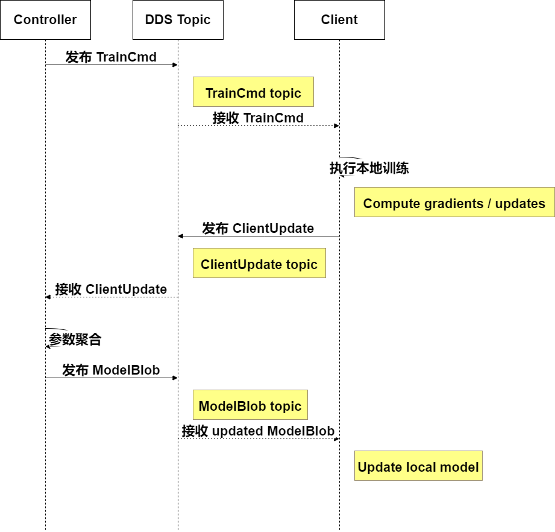

**分布式数据并行**


## 原理介绍
### 联邦学习优化
### 1) INT8 量化

目的：把一整条 FP32 权重向量 压到 INT8 后再传，带宽约为 FP32 的 1/4

算法
- 按块长 chunk=C 把 w 切为 n=<<D/C>> 个块。
- 每块tensor大小：s_i = max_abs_in_block / 127
- 量化q_j = clip( round(w_j / s_i), -127, 127 )
- 反量化 w_hat_j = q_j * s_i


带宽分析
- D = 向量长度，C = chunk
- bytes_Q8  ≈  D * 1  +  (D / C) * 4
- bytes_FP32 =  D * 4
- 当 C >= 1024 时，scale开销很小，bytes_Q8 / bytes_FP32 ≈ 1/4（我们实际跑用的8192）

### 2) FP32 稀疏 

目的：只传本轮参数更新梯度的非零条目（Top-K），通过稀疏性省带宽。

算法
- 从本轮 中选择幅值最大的 K 个，稀疏度r=K/D（我们跑的时候取10%）。
- 仅发送这些 索引 + 浮点值；Controller 端按索引复原并聚合

带宽分析
- 每个非零梯度 = 索引 4B + 值 4B = 8B
- 若r=10%， 传输量2 * 10% = 20% 
### 分布式数据并行优化
>《Deep Gradient Compression: 
>Reducing The Communication Bandwidth For Distributed Training》
>聚焦分布式训练中的通信带宽瓶颈问题，提出深度梯度压缩（DGC）技术，
>在不损失模型精度的前提下大幅降低梯度传输数据量，为大规模分布式训练
>（尤其是移动端联邦学习）提供高效解决方案。
> DGC方法由以下六个部分组成：
>
>1）Gradient Sparsification
>
>2）Local Gradient Accumulation
>
>3）Momentum Correction
>
>4）Local Gradient Clipping
>
>5）Momentum Factor Masking
>
>6）Warm-up Training

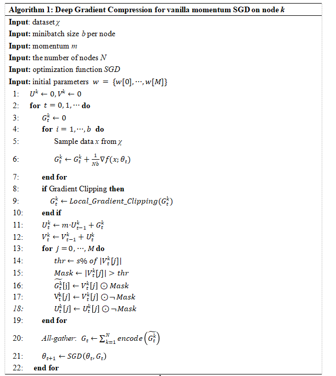
> 1至7行描述了节点局部梯度更新的过程。
> 
> 8至10行是局部梯度裁剪操作。
> 
> 11、12两行涉及到动量修正。
> 
> 13至19行进行了梯度稀疏化操作，筛选出重要梯度，同时也保留次要梯度和其对应的动量项用于局部梯度累积。此外，这涉及到动量因子掩码操作，以应对延迟效应（Staleness Effect）。
> 
> 20行是梯度聚合操作，得到全局梯度。
> 
> 21行使用vanilla momentum SGD，通过全局梯度和历史模型参数更新模型参数。
## 详细设计
### 联邦学习
**数据类型**
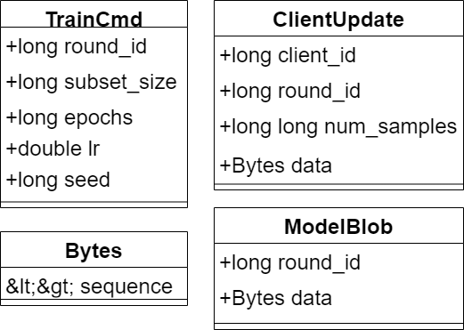
| 数据结构名     | DDS Topic 名称                | 用途 / 功能主题说明                                          |
| -------------- | ----------------------------- | ------------------------------------------------------------ |
| `TrainCmd`     | `train_scripts/train_cmd`     | Controller → Client：下发每轮训练指令（round, epoch, lr 等） |
| `ClientUpdate` | `train_scripts/client_update` | Client → Controller：上传本地训练后的梯度更新                |
| `ModelBlob`    | `train_scripts/model_blob`    | Controller → Client：广播聚合后的全局模型                    |
**组件讲解**
```
Client.start(self)
```
初始化 DDS 参与者与 Topic、创建读写端、监听器，进入接收 `TrainCmd`的状态
```
Client.run_training(self, round_id, subset, epochs, lr, seed)
```        
按 `TrainCmd` 进行一轮本地训练
```
Client._s4_to_sq8_bytes(s4: bytes, chunk: int) -> bytes
```
把稀疏的FP32浮点数梯度压缩成int8类型，解析s4格式（用于描述稀疏增量的打包格式 S4：'S','4',0,1 | dim | k | idx[k] | vals[k]），计算 nChunks，求出scale后进行量化，然后重新打包
```
_TrainCmdListener.on_data_available() & _process(cmd)
```
接收并处理 `TrainCmd`；拉起训练并将结果写成 `ClientUpdate`,在`on_data_available`取样本
```
_ModelBlobListener.on_data_available()) & _process(mb)
```
收控制端发布的全局 FP32 模型，更新最近的模型。
```
Controller.init(self)
```
初始化 DDS Domain、Participant、根据配置文件选择barrier、设置监听。

```
Controller.run_round(self, subset_size, epochs, lr, seed)
```
写 `TrainCmd(round_id, subset_size, epochs, lr, seed)`,调用`_wait_for_streams(round_id, expected, min_clients, timeout_ms)`,等到至少 min_clients_to_aggregate 个客户端“完成,再调用`_collect_vectors(streams)`把各客户端包解码，最后调用`_apply_and_publish(cvs, round_id)`做梯度累加并在DDS中广播模型（发ModelBlob）

```
Controller._wait_for_streams(self, round_id, expected_clients, min_clients, timeout_ms) -> Dict[int, ClientStream]
```

轮询统计完成数并打印 final-ready=X/expected (min=Y)；达标或超时返回（优先返回已完成者）。 

```
Controller._collect_vectors(self, streams) -> List[ClientVec]
```
同一客户端多包：按前缀识别并解码（SQ8/S4/Q8/FP32），逐元素相加成单一向量；仅含 S4/SQ8则 `is_delta=True`；是`num_samples`就 取Client最后一包。 
### 分布式数据并行
## 性能测试结果与分析
### 联邦学习实验条件
- batch_size：64
- epochs per round：1
- subset per round: 6000 
- rounds：10
> 硬件配置
> 
> controller: 
> 
> 12th Gen Intel(R) Core(TM) i5-1240P 
>
> worker:
> 
> 13th Gen Intel(R) Core(TM) i9-13900H
> 
> 13th Gen Intel(R) Core(TM) i9-13980HX

>
>
### 分布式数据并行
以下四张图是我们的分布式数据并行baseline版本和DGC版本各方面的对比
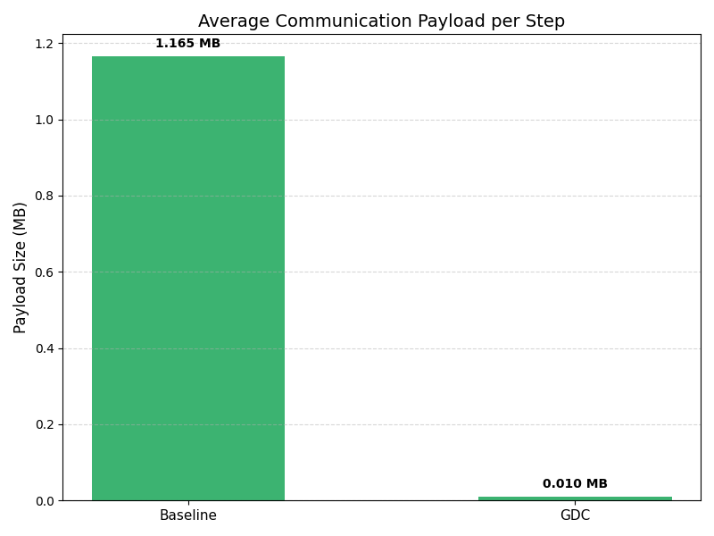
图1：数据传输量比较

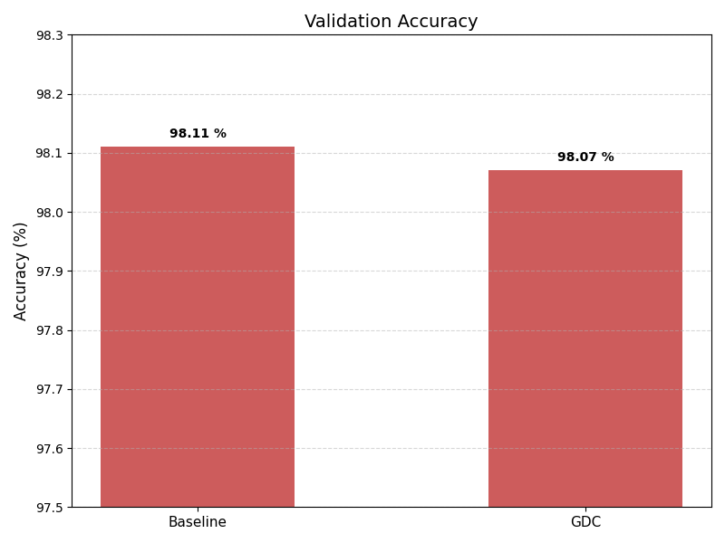
图2：准确率比较

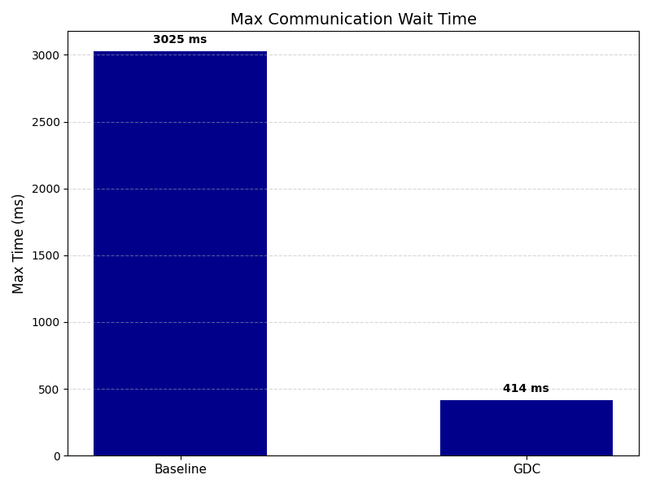
图3：最大通信时间比较（由于存在带宽没有打满的情况，最大值的差距更能体现性能之差）

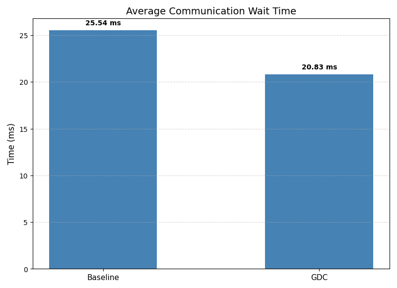
图4：平均通信时间比较（由于存在带宽没有打满的情况，平均值差距并不大）
### 联邦学习优化
以下四张图是我们的四种联邦学习优化在各方面的指标，fp32作为联邦学习baseline， int8_dense是量化版本， fp32_sparse只取前10%的梯度进行传输， int8_sparse结合了前面两种优化方法

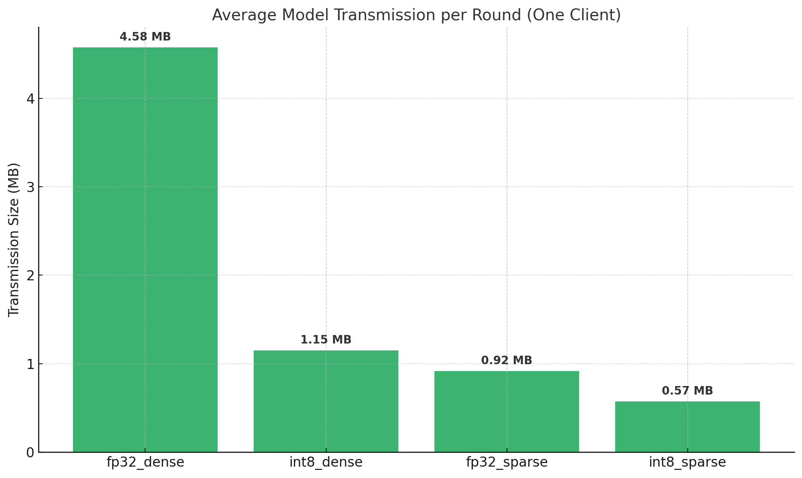
图1：四种方式数据传输量比较


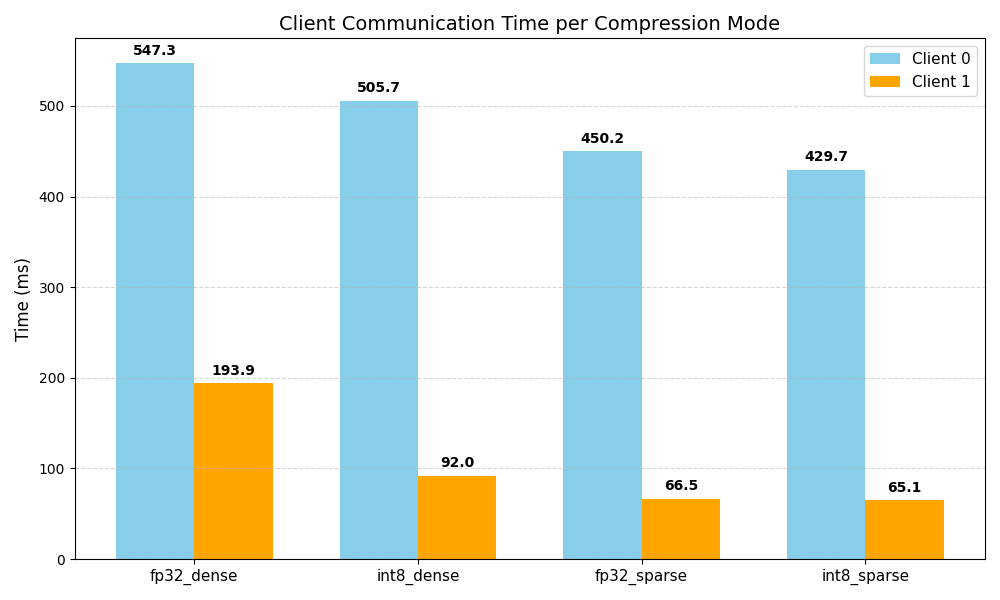
图2：四种方式DDS通信时间比较，Client1和Client0是与Controller通信的两台不同机器

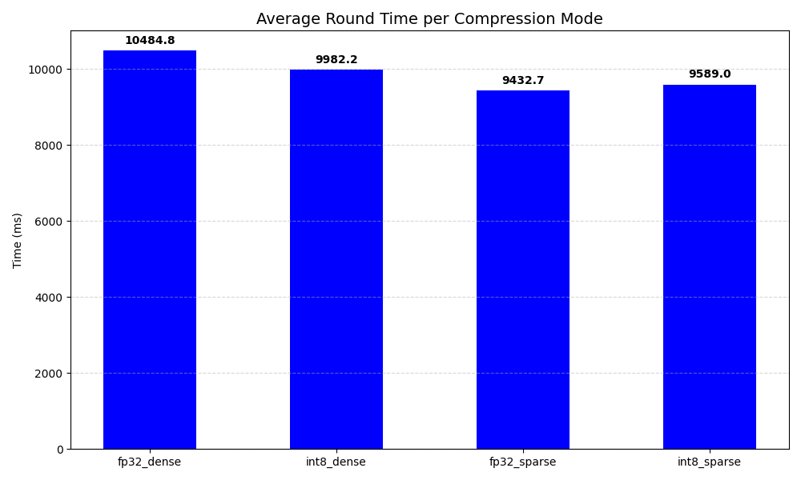
图3：四种方式每一轮时间比较，从发出训练命令开始到聚合并发布下一轮模型结束

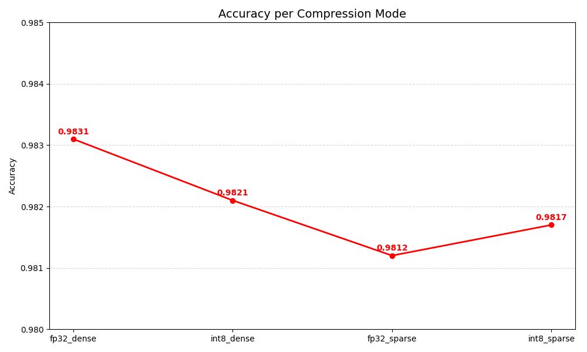
图4：四种方式模型精度比较，取10轮的最终结果

### 联邦学习
## 使用方法
**联邦学习**
>编写对应的配置文件（如运行controller，就写一份controller.conf.json）,在命令行中以配置文件路径作为形参，然后启动训练的程序即可（Controller.py和Client.py）
**分布式数据并行**
通过环境变量设置每台机器的WORLD和RANK，然后直接运行train.py或train_base.py


