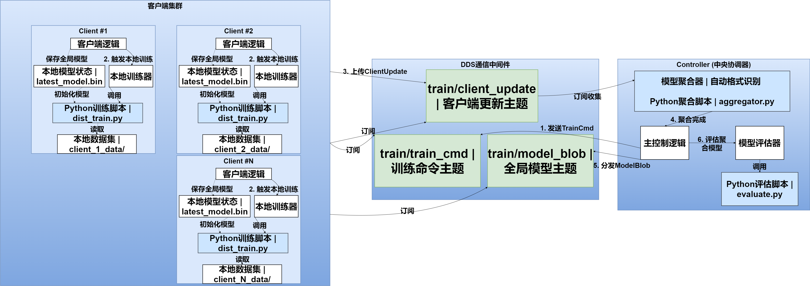
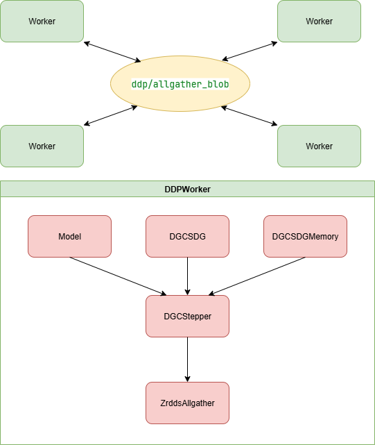
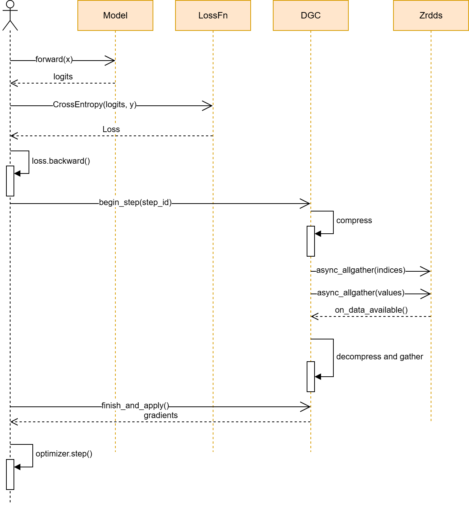

# 分布式训练框架
## 需求分析
分布式训练存在两种范式：注重隐私的联邦学习和注重速度的分布式数据并行。

前者有中心服务器（controller）和实际执行训练的机器（worker），每次worker进行完一个或多个epoch后向中心服务器发送得到的梯度，在中心服务器上聚合后再进行发布并开始下一轮训练；
而在分布式数据并行中，每台机器的地位都是相等的，每训练一个step后通过allreduce或allgather这样的集合通信传播梯度。

框架需要同时支持这两种范式并且对它们进行不同方面的优化

## 支持的特性
**联邦学习**
- 订阅发布barrier: Controller在双方匹配上后才开始发训练指令
- 断点重连：在每一轮的超时时间内，只要收到一个Client的结果就可以进行下一轮
- 高扩展性：通过配置文件来制定训练模型，数据、脚本
- 传输数据量优化:可以在V2中通过配置文件使用int8量化，可以将传输梯度量减少到原来的1/4
- 传输数据量优化:可以在V3中通过选用前10%的稀疏梯度减少传输量
  
**分布式数据并行**
- barrier: 在所有Worker匹配上后才开始进行训练
- 详细profile指标：统计数据传输量、dds通信时间、模型训练时间等详细指标
- 基于ZRDDS实现的分布式算子： allgather（稀疏梯度用）、allreduce
- DGC优化（[deep gradient compression](https://arxiv.org/pdf/1712.01887), ICLR2018）: 热身后每个step仅更新0.1%的梯度进行训练，通过本地梯度累积和动量修正达到接近的精度
## 项目结构


```
distributed_training/
├── federated_learning/
│   ├── __init__.py
│   ├── Client_v2.py
│   ├── Client_v3.py
│   ├── Controller_v2.py
│   ├── Controller_v3.py
│   ├── client_v2.conf.json
│   ├── client_v3.conf.json
│   ├── controller_v2.conf.json
│   └── controller_v3.conf.json
│ 
│──normal_distributed/
│   ├── baseline/
│   │   ├── dds_barrier_verbose_baseline.py
│   │   ├── dgc_evalBaseline.py
│   │   ├── dgc_stepperBaseline.py
│   │   ├── trainbase.py
│   │   └── zrdds_dense_broadcast.py
│   └── dist_train_ddp_dgc/
│         ├── data/
│         │   ├── compression.py
│         │   ├── dds_barrier_verbose.py
│         │   ├── dgc_eval.py
│         │   ├── dgc_stepper.py
│         │   ├── DGCSGD.py
              ├── zrdds_allgather.py
│         │   └── memory.py
│         └── train.py
│ 
│──federal_train_scripts/
    ├── aggregator.py
    ├── centric_train.py
    ├── dist_train_v2.py
    ├── dist_train_v3.py
    └── evaluate.py
```
## 架构图
**联邦学习**


**分布式数据并行**



## 流程图



## 性能测试结果与分析

## 使用方法
